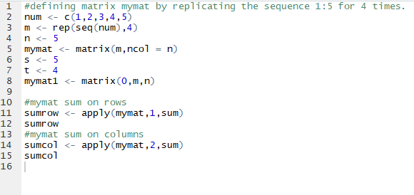

# Assignment-3.2
assignments for Acadgild Data Science with R course

#Define matrix mymat by replicating the sequence 1:5 for 4 times and transforming into a matrix, sum
over rows and columns.
code:

solution:     

